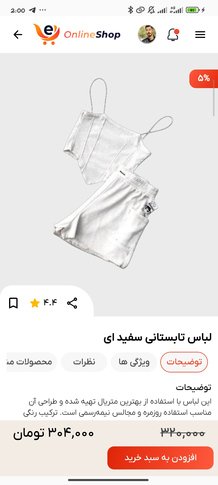

## 📖 Overview

**Online Shop** is a modern Android e-commerce application focused on delivering a fast, responsive, and visually engaging shopping experience.

The project is built entirely with **Jetpack Compose** and follows a clean **MVVM architecture**, making the codebase scalable, maintainable, and easy to extend. It showcases modern Android development practices, including dependency injection with **Hilt**, local data persistence using **Room**, and efficient image loading with **Glide**.

One of the highlights of the application is the implementation of **Shared Element Transitions**, creating smooth and immersive navigation between product lists and detail screens.

## ✨ Key Features

* Modern Single-Activity architecture
* Clean MVVM implementation
* Product catalog browsing
* Shopping cart functionality
* Shared Element screen transitions
* Material 3 design system
* Dark mode support
* Responsive and intuitive UI built with Compose

## 🛠 Tech Stack

| Category             | Technology            |
| -------------------- | --------------------- |
| Architecture         | MVVM                  |
| UI Toolkit           | Jetpack Compose       |
| Design System        | Material 3            |
| Dependency Injection | Dagger-Hilt           |
| Local Storage        | Room Database         |
| Image Loading        | Glide                 |
| Navigation           | Compose Navigation    |
| Animations           | Shared Transition API |

## 📱 Screenshots

Explore the main sections of the application, including product browsing, category filtering, favorites, cart management, user profile, and detailed product views.
<table style="width:100%"> <tr> <th>Home Screen</th> <th>Category Screen</th> <th>Cart Screen</th> </tr> <tr> <td></td> <td></td> <td></td> </tr> <tr> <th>Profile Screen</th> <th>Favorit Screen</th> <th>ProductDetail Screen</th> </tr> <tr> <td></td> <td></td> <td></td> </tr> </table>
